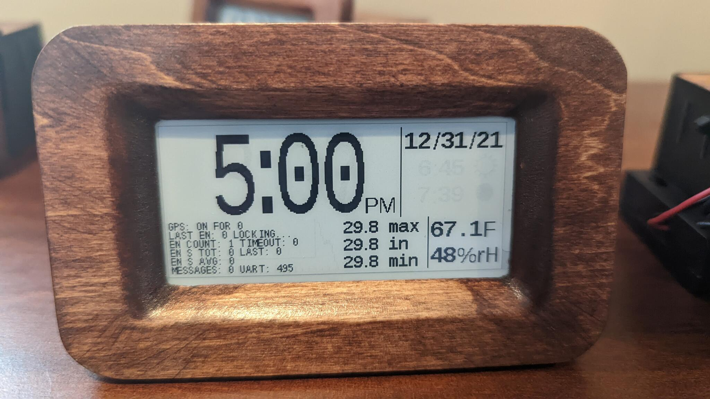
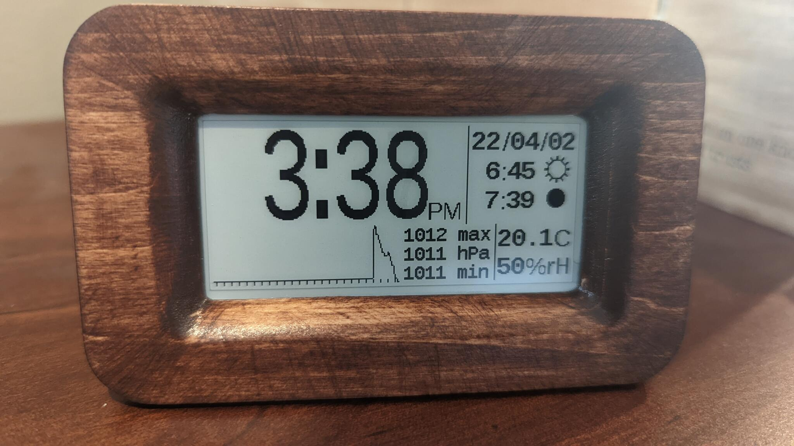
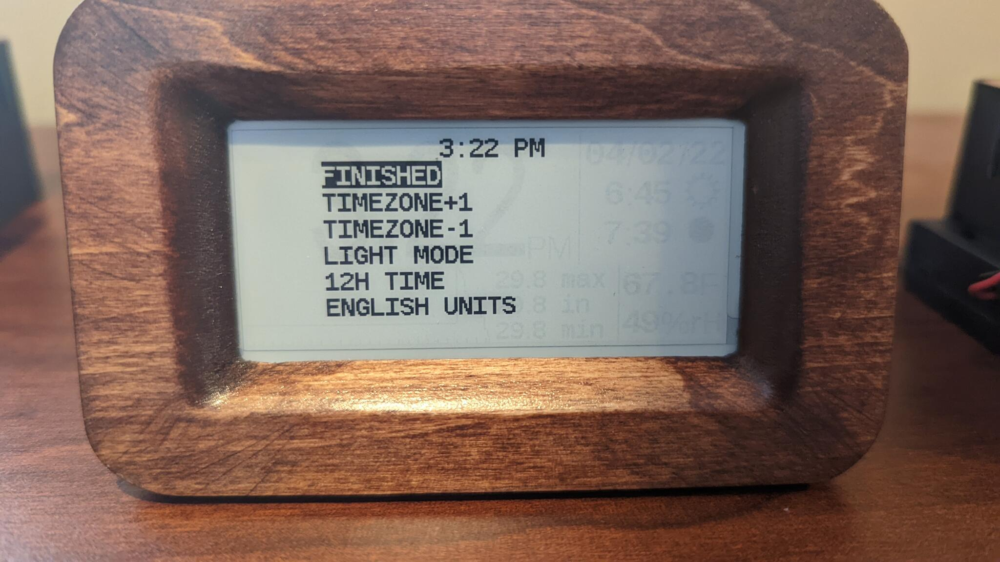

# User's Guide

When you power on the unit.  It will use GPS to determine the current time
and position (needed for sunrise/sunset calculations).  While this is happening,
the time may not be correct and the unit will show GPS information that will
dissapear after there is a lock.  It can help to have the clock near a window
at this time.

After there is a lock, the GPS will turn off for 24 hours.  At this time the clock
will look something like this:

Time timezone (hour) is likely to be incorrect.  You can fix it in the options menu.
Press the options button (one of the two) and you will see this:

The `TIMEZONE+1` and `TIMEZONE-1` options can correct the hour.  Press the options
button to select your option and the select button to change the option.

Other options include:

   * `FINISHED`: Go back to the clock screen
   * `LIGHT MODE`: Change between "black text on a white background" and
     "white text on a black background"
   * `12H TIME`: Change between 12 and 24 hour time format
   * `ENGLISH UNITS`: Change between English and metric units

## GPS activity

If the GPS locks quickly, it will activate once per day to correct time skew.
For every minute the GPS takes to lock, it will wait an additional day to try
again.  For example, if the GPS takes 3 minutes to lock, it will wait three
days before trying again.  After 10 minutes, GPS will give up trying to lock
and try again 10 days later (assuming you don't turn the clock off and back
on).  This is done to preserve battery life on clocks with bad GPS signals
since correcting time skew is often something that can wait a few days.

## GPS Status Screen

Press the select button to toggle this on and off.  You don't need to
know what the fields mean but if you are curious, here you go:

   * `GPS: ON FOR ...`: How long the GPS has been on for (when it is on)
   * `GPS: NEXT ...`: How many seconds until GPS is turned on again
   * `LAST_EN`: How many seconds ago the GPS was enabled
   * `LAST_LOCK`: How many seconds ago the GPS locked successfully
   * `EN COUNT`: How many times the GPS was turned on
   * `TIMEOUT`: How many times the GPS took 10 minutes and still no lock
   * `EN S TOT`: The total number of seconds the GPS has been on
   * `EN S LAST`: The number of seconds the GPS was on the last time it was enabled.
   * `EN S AVG`: `EN_S_TOT` / `EN_COUNT`
   * `MESSAGES`: How many messages the GPS has sent to the clock
   * `UART`: How many bytes the GPS has sent to the clock

